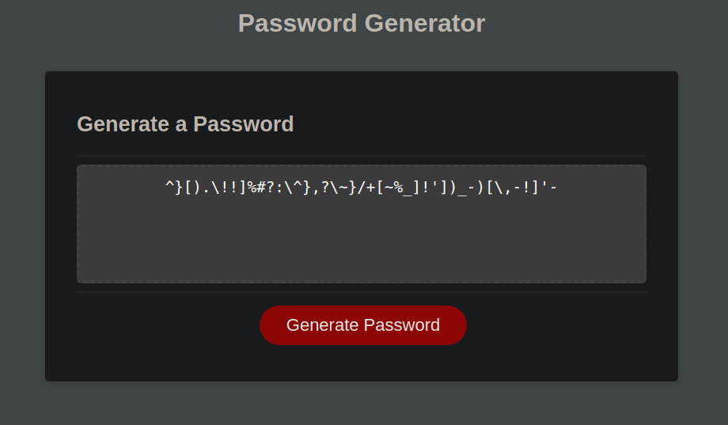

# random_password_generator-by-SehCheong

Using javascript to create a random password generator app.

Thie application is used to generate password (10 to 64 characters) with specific sets of characters (special character, numeric, upper cased, lower cased).

App link: https://sehcheong-ng.github.io/random_password_generator/

By clicking the generate password, the user will be prompt to input the length for the password to be generated. Next, the user will be asked to confirm which of the character set they wish to include in the password. When the selection is done, the application will perform the magic and generate the password, do keep it safe!

Enjoy!